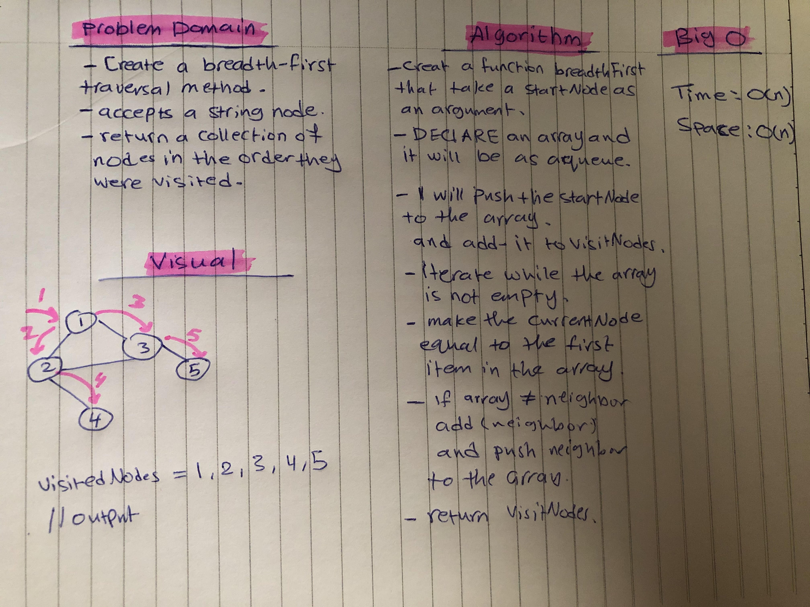

# Graphs

## Challenge
Extend your graph object with a breadth-first traversal method that accepts a starting node. Without utilizing any of the built-in methods available to your language, return a collection of nodes in the order they were visited. Display the collection.

## Approach & Efficiency
I used ES6 class syntax to create my own Graph class. To make my implementation concise and understandable, I also created a Vertex and Edge class that the Graph's methods could use.

### Big O
#### breadthFirst()
- Time : O(n)
- Space : O(n)

## solution
