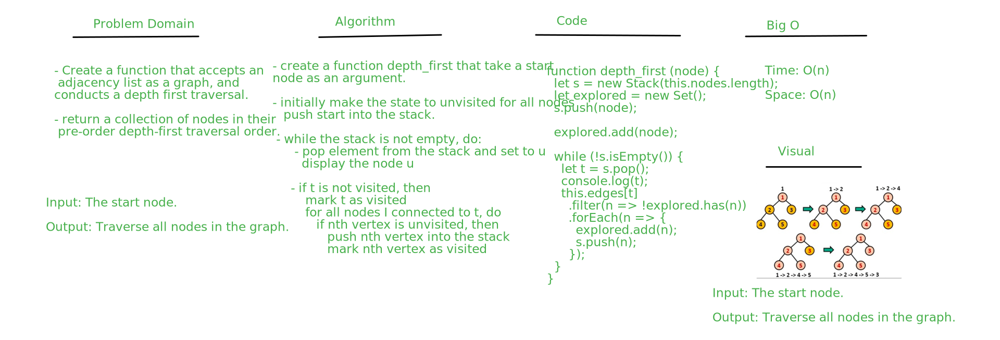

# depth-first

## Challenge
Create a function that accepts an adjacency list as a graph, and conducts a depth first traversal. Without utilizing any of the built-in methods available to your language, return a collection of nodes in their pre-order depth-first traversal order.

## Approach & Efficiency
I used ES6 class syntax to create my own Graph class. To make my implementation concise and understandable, I also created a Vertex and Edge class that the Graph's methods could use.

### Big O
#### depth_first()
- Time : O(n)
- Space : O(n)

## solution
