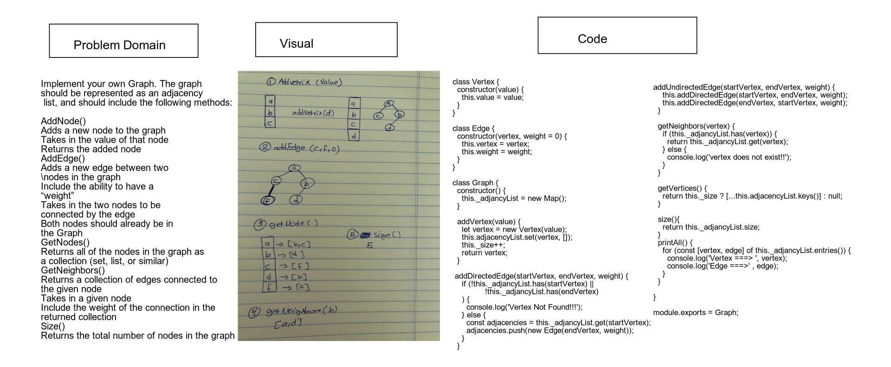

# Graphs

## Challenge
Implement your own Graph. The graph should be represented as an adjacency list, and should include the following methods:

AddNode()
Adds a new node to the graph
Takes in the value of that node
Returns the added node
AddEdge()
Adds a new edge between two nodes in the graph
Include the ability to have a “weight”
Takes in the two nodes to be connected by the edge
Both nodes should already be in the Graph
GetNodes()
Returns all of the nodes in the graph as a collection (set, list, or similar)
GetNeighbors()
Returns a collection of edges connected to the given node
Takes in a given node
Include the weight of the connection in the returned collection
Size()
Returns the total number of nodes in the graph

## Approach & Efficiency
I used ES6 class syntax to create my own Graph class. To make my implementation concise and understandable, I also created a Vertex and Edge class that the Graph's methods could use.

### Big O
#### AddNode()
- Time : O(1)
- Space : O(n)
#### AddEdge()
- Time : O(1)
- Space : O(1)
#### GetNodes()
- Time : O(1)
- Space : O(n)
#### Size()
- Time : O(1)
- Space : O(1)

## solution
