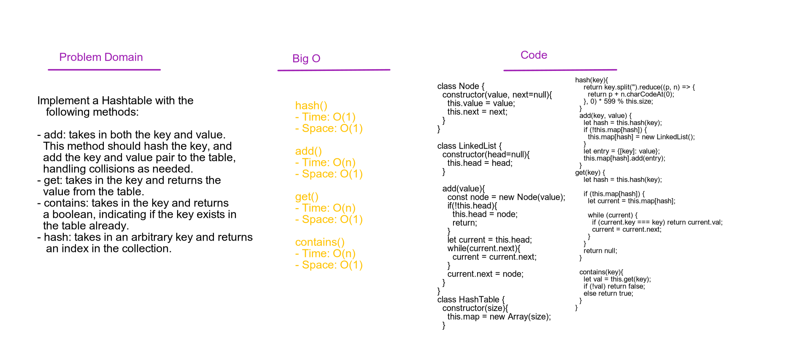

# Hashtables

## Challenge
Implement a Hashtable with the following methods:

- add: takes in both the key and value. This method should hash the key, and add the key and value pair to the table,   handling collisions as needed.
- get: takes in the key and returns the value from the table.
- contains: takes in the key and returns a boolean, indicating if the key exists in the table already.
- hash: takes in an arbitrary key and returns an index in the collection.

## Approach & Efficiency
### Big O:
### hash()
- Time: O(1)
- Space: O(1)
### add()
- Time: O(n)
- Space: O(1)
### get()
- Time: O(n)
- Space: O(1)
### contains()
- Time: O(n)
- Space: O(1)

## Solution
- 