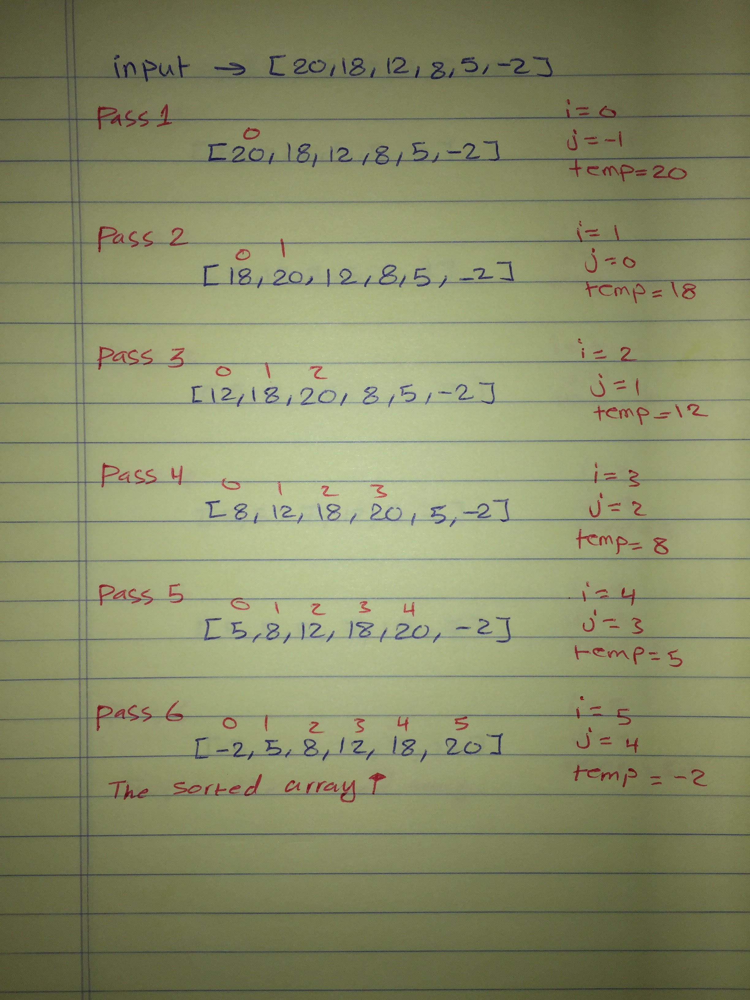

# insertion-sort

## Challenge
Review the pseudocode below, then trace the algorithm by stepping through the process with the provided sample array. Document your explanation by creating a blog article that shows the step-by-step output after each iteration through some sort of visual.

Once you are done with your article, code a working, tested implementation of Insertion Sort based on the pseudocode provided.

## Pseudocode
```javascript
 InsertionSort(int[] arr)
  
    FOR i = 1 to arr.length
    
      int j <-- i - 1
      int temp <-- arr[i]
      
      WHILE j >= 0 AND temp < arr[j]
        arr[j + 1] <-- arr[j]
        j <-- j - 1
        
      arr[j + 1] <-- temp
```
## The code 
```javascript
const insertionSort = (arr) => {

  for(let i=0; i < arr.length; i++){
    let  j = i-1;
    let temp = arr[i];
  
    while(j>=0 && temp<arr[j]){
      arr[j+1] = arr[j];
      j = j-1;
    }
    arr[j+1] = temp;
  }
  return arr;
};
```

## Approach & Efficiency
## Efficiency
### Big O :
- Time: O(n), Because I used loops.
- Space: O(n), Because I return array.

## Solution



