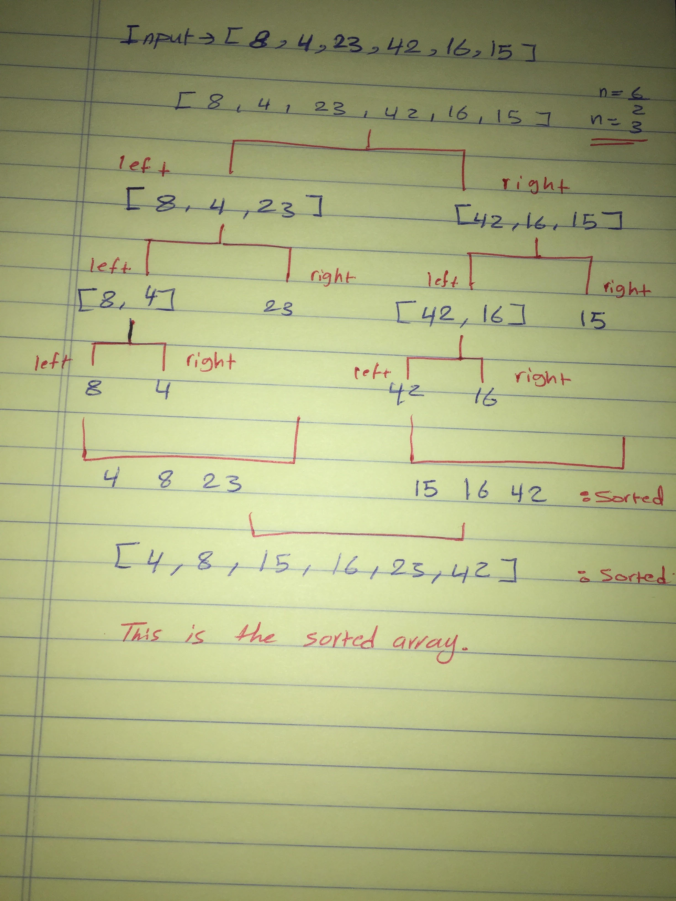

# insertion-sort

## Challenge
Review the pseudocode below, then trace the algorithm by stepping through the process with the provided sample array. Document your explanation by creating a blog article that shows the step-by-step output after each iteration through some sort of visual.

Once you are done with your article, code a working, tested implementation of Insertion Sort based on the pseudocode provided.

## Pseudocode
```javascript
 ALGORITHM Mergesort(arr)
    DECLARE n <-- arr.length
           
    if n > 1
      DECLARE mid <-- n/2
      DECLARE left <-- arr[0...mid]
      DECLARE right <-- arr[mid...n]
      // sort the left side
      Mergesort(left)
      // sort the right side
      Mergesort(right)
      // merge the sorted left and right sides together
      Merge(left, right, arr)

ALGORITHM Merge(left, right, arr)
    DECLARE i <-- 0
    DECLARE j <-- 0
    DECLARE k <-- 0

    while i < left.length && j < right.length
        if left[i] <= right[j]
            arr[k] <-- left[i]
            i <-- i + 1
        else
            arr[k] <-- right[j]
            j <-- j + 1
            
        k <-- k + 1

    if i = left.length
       set remaining entries in arr to remaining values in right
    else
       set remaining entries in arr to remaining values in left
```
## The code 
```javascript
'use strict';

function mergesort(arr){
  let n = arr.length;

  if(n>1){
    let mid=n/2;
    let left = arr.slice(0,mid);
    let right = arr.slice(mid,n);

    mergesort(left);
    mergesort(right);
    return merge(left, right, arr);
  }

} 

function merge(left, right, arr){
  let i = 0;
  let j = 0 ;
  let k = 0 ;

  while(i<left.length && j<right.length){
    if(left[i] <= right[j]){
      arr[k] = left[i];
      i++;
    }else{
      arr[k]=right[j];
      j++;
    }
    k++;
  }
  if(i==left.length){
    while(j<right.length){
      arr[k]=right[j];
      j++;
      k++;
    }
  }else{
    while(i<left.length){
      arr[k]=left[i];
      i++;
      k++;
    }
  }
  return arr;
}
  

module.exports =mergesort;
```

## Approach & Efficiency
## Efficiency
### Big O :
- Time: O(nLogn).
- Space: O(n).

## Solution

