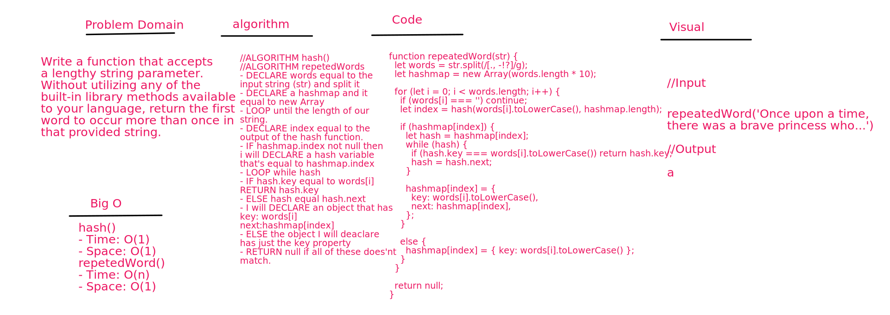

# repetedWord

## Challenge
Write a function that accepts a lengthy string parameter.
Without utilizing any of the built-in library methods available to your language, return the first word to occur more than once in that provided string.

## Approach & Efficiency
### Big O:
### hash()
- Time: O(1)
- Space: O(1)
### repetedWord()
- Time: O(n)
- Space: O(1)

## Solution
- 