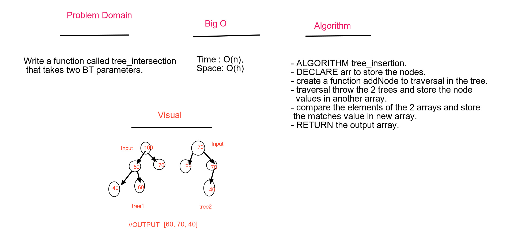

# Find common values in 2 binary trees.
We have to know how to deal with nodes, tree and hashtable.

## Challenge
Write a function called tree_intersection that takes two binary tree parameters.
Without utilizing any of the built-in library methods available to your language, return a set of values found in both trees.

## Approach & Efficiency
## Efficiency
### Big O :

### tree_intersection() 
- Time : O(n), Because I use BinaryTree.
- Space : O(h), The high of tree.

## Solution
- 
